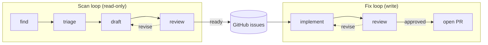

# agency

> [!CAUTION]
> **Agency is a research project. If your name is not Michael Uloth, do not use it.**
>
> This software may change or break without notice. No support or warranty is provided.
> Use at your own risk.

Autonomous agent loops that scan projects for problems and fix them.



**Scan** runs read-only: queries logs, reads codebases, or checks whatever
you configure — surfaces anything worth acting on, and posts well-formed
GitHub issues. **Fix** runs write: picks up open issues, implements solutions
in fresh agent subprocesses, and opens PRs after a review pass. GitHub issues
are the handoff — scan and fix are deliberately decoupled.

The loops are fixed. What varies is the scan configuration. Adding a new scan
type is adding a prompt file and a scan block in `projects.json`. Each project
configures each scan type with its own calibration — what's normal, what to
flag, what to ignore — while the same loop machinery handles the rest.

---

## Setup

See [CONTRIBUTING.md](./CONTRIBUTING.md).

## Usage

```bash
# scan a project (dry run — prints issues without posting)
uv run python run.py scan agency --type codebase --dry-run

# scan and post issues
uv run python run.py scan agency --type codebase

# fix a specific issue in a specific project
uv run python run.py fix --issue 3 --project agency

# fix the next open issue labelled 'agent'
uv run python run.py fix

# with secrets from 1Password
op run --env-file=secrets.env -- uv run python run.py scan pilots --type logs
```

---

## Docs

| What                                            | Where                          |
| ----------------------------------------------- | ------------------------------ |
| Philosophy and goals                            | `docs/philosophy.md`           |
| Invariants to uphold                            | `docs/rules.md`                |
| Design decisions                                | `docs/decisions/`              |
| Roadmap                                         | `docs/roadmap.md`              |
| Auth strategies by provider                     | `docs/architecture/auth.md`    |
| How to add projects, scan types, debug failures | `docs/playbooks/`              |
| Discoveries from running the loops              | `docs/learnings/`              |
| Registered projects and data sources            | `projects/projects.json`       |
| Open issues to fix                              | `gh issue list`                |
