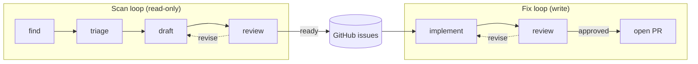

# agency

> [!CAUTION]
> **Agency is a research project. If your name is not Michael Uloth, do not use it.**
>
> This software may change or break without notice. No support or warranty is provided.
> Use at your own risk.

Agency contains autonomous agent loops that scan projects for problems and then fix them.



- **Scan runs are read-only**: they query logs, read codebases, or check whatever else you can think
  of to configure — they surface anything worth acting on, and post well-formed GitHub issues
- **Fix runs write**: they pick up open issues, implement solutions in fresh agent subprocesses,
  and open PRs after a review pass. GitHub issues are the handoff mechanism — scan and fix are
  deliberately decoupled
- **The loops are fixed:** what varies are the scan configurations. Adding a new scan type is adding a
  prompt file and a scan block in `projects.json`. Scans configurations can be applied to multiple
  projects or calibrated for just one — what's normal, what to flag, what to ignore — while the
  same loop machinery handles the rest.

---

## Setup

See [CONTRIBUTING.md](./CONTRIBUTING.md).

## Usage

```bash
# scan a project (dry run — prints issues without posting)
uv run python run.py scan agency --type codebase --dry-run

# scan and post issues
uv run python run.py scan agency --type codebase

# fix a specific issue in a specific project
uv run python run.py fix --issue 3 --project agency

# fix the next open issue labelled 'agent'
uv run python run.py fix

# with secrets from 1Password
op run --env-file=secrets.env -- uv run python run.py scan pilots --type logs
```

---

## Docs

| What                                            | Where                       |
| ----------------------------------------------- | --------------------------- |
| Philosophy and goals                            | `docs/philosophy.md`        |
| Design decisions                                | `docs/decisions/`           |
| Invariants to uphold                            | `docs/rules.md`             |
| Discoveries from running the loops              | `docs/learnings/`           |
| How to add projects, scan types, debug failures | `docs/playbooks/`           |
| Auth strategies by provider                     | `docs/architecture/auth.md` |
| Roadmap                                         | `docs/roadmap.md`           |
