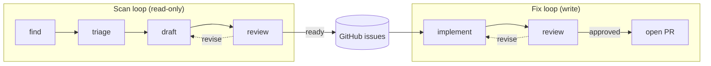

# agency

> [!CAUTION]
> **Agency is a research project. If your name is not Michael Uloth, do not use it.**
>
> This software may change or break without notice. No support or warranty is provided.
> Use at your own risk.

Agency is a base of operations for the projects you maintain — a command center from which you scan
for issues, triage findings, and implement fixes. You register projects and their monitoring use
cases here, and your effects land in those projects as issues and PRs.



## How it works

- **Scan runs read**: they query logs, read codebases, or check whatever else you configure
  — they analyze what they see and propose worthwhile actions by posting well-formed GitHub issues
- **Fix runs write**: they pick up open issues, implement solutions in fresh agent subprocesses,
  and open PRs after a review pass — GitHub issues are the handoff mechanism, so scan and fix run
  on independent schedules
- **The loops are fixed**: what varies are the scan configurations — adding a new scan type is
  adding a prompt file and a scan block in `projects.json`; calibrations can be shared across
  projects or tuned per project while the same loop machinery handles the rest

---

## Setup

See [CONTRIBUTING.md](./CONTRIBUTING.md).

## Configure

### Register a project

Add an entry to `projects/projects.json`:

```json
{
  "id": "my-project",
  "name": "My Project",
  "path": "~/Repos/me/my-project",
  "install": "npm ci",
  "test": "npm test",
  "scans": [
    {
      "type": "codebase/dead-code",
      "normal": ["Utility helpers that are imported dynamically"],
      "flag": ["Exported functions with no internal or external callers"],
      "ignore": ["Legacy adapters kept for backwards compatibility"]
    }
  ]
}
```

`normal`, `flag`, and `ignore` are required — they calibrate the agent to each project's specific
signal and noise rather than relying on generic heuristics.

### Add a scan type

1. Add a prompt file to `prompts/scan/find/` describing what to look for
2. Add a matching scan block (with `type`, `normal`, `flag`, `ignore`) to the project in
   `projects.json`

See [docs/playbooks/](docs/playbooks/) for step-by-step instructions.

## Run

```bash
# Scan a project (dry run — prints issues without posting)
uv run python run.py scan my-project --type codebase/dead-code --dry-run

# Scan a project and post issues
uv run python run.py scan my-project --type codebase/dead-code

# Fix a specific issue
uv run python run.py fix --issue 3 --project my-project

# Fix the next open issue labelled 'agent'
uv run python run.py fix

# Run with secrets from 1Password exposed as environment variables
op run --env-file=secrets.env -- uv run python run.py scan pilots --type logs/error-spikes
```

## Schedule

Edit your crontab with `crontab -e`:

```
# nightly at 2am — use absolute paths; cron has a minimal environment
0 2 * * * cd ~/path/to/agency && /opt/homebrew/bin/op run --env-file=secrets.env -- ~/.local/bin/uv run python run.py scan my-project --type codebase/dead-code
```

Or use GitHub Actions or your favourite other scheduler.

---

## Docs

| What                                            | Where                                                  |
| ----------------------------------------------- | ------------------------------------------------------ |
| Philosophy and goals                            | [docs/philosophy.md](docs/philosophy.md)               |
| Design decisions                                | [docs/decisions/](docs/decisions/)                     |
| Invariants to uphold                            | [docs/rules.md](docs/rules.md)                         |
| Discoveries from running the loops              | [docs/learnings/](docs/learnings/)                     |
| How to add projects, scan types, debug failures | [docs/playbooks/](docs/playbooks/)                     |
| Auth strategies by provider                     | [docs/architecture/auth.md](docs/architecture/auth.md) |
| Scan cadence and entropy management             | [docs/architecture/scan-cadence.md](docs/architecture/scan-cadence.md)                         |
| Harness self-improvement                        | [docs/architecture/harness-self-improvement.md](docs/architecture/harness-self-improvement.md) |
| Conventions                                     | [docs/conventions/](docs/conventions/)                                                         |
| Roadmap                                         | [docs/roadmap.md](docs/roadmap.md)                     |

---

## Inspiration

<!-- TODO: credit workos/case here -->
